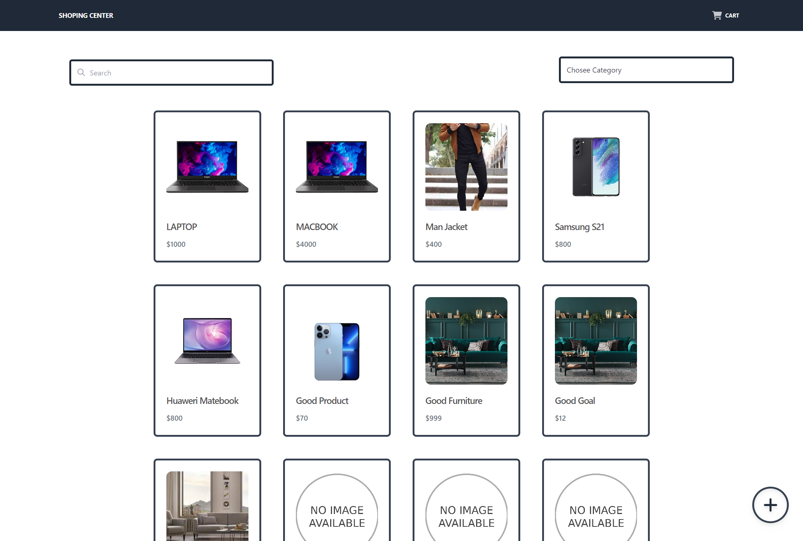
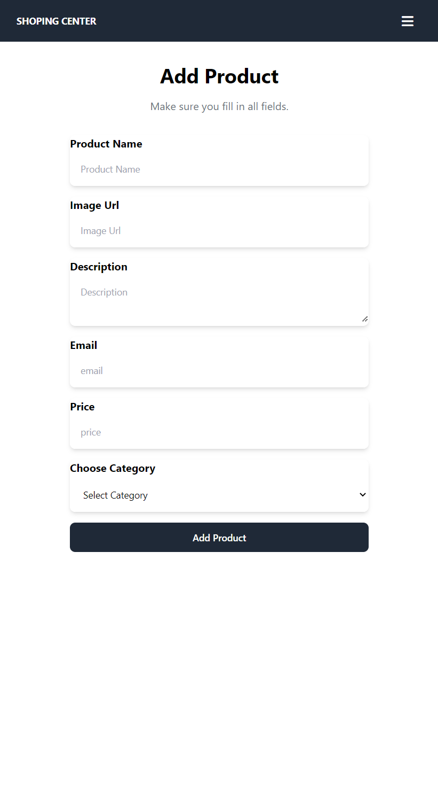
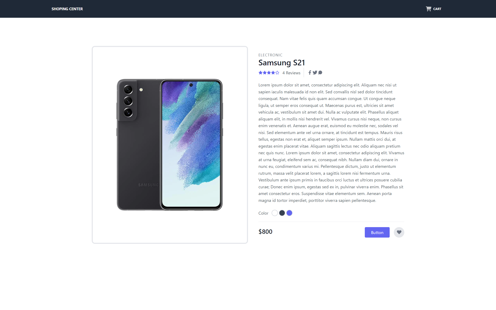
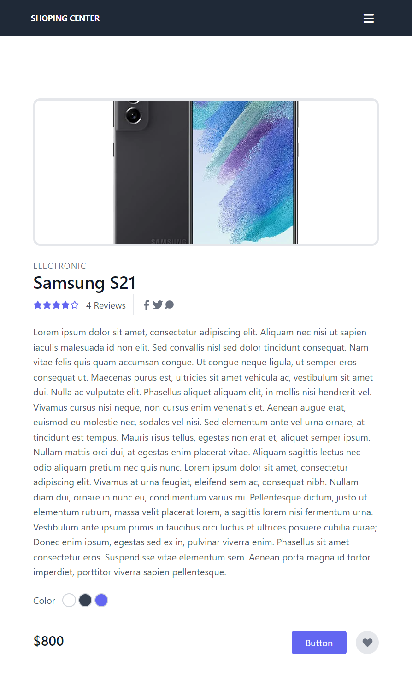

# Shopping Center

<!-- prettier-ignore -->
| SUPERSET | TECHNOLOGY | STYLE | LINTERS | DEPLOY |
|--|--|--|--|--|
| | | | | |

Typescript is a simple, instructive e-commerce project made with React.js, Tailwind.
## Functions;

Users
- can add products
- can see products
- can search among products
- can list products by category
- can view the product detail.

## [Click to try the project in the online version](https://shopping-center-eight.vercel.app/)

<!-- prettier-ignore -->
If you want to try the project in your local, follow the steps below

1. Clone the repository to your local.
2. Run `yarn` command
3. Create a .env file in the area where the package.json file is located. Paste the text below into it.

```
REACT_APP_BASE_URL=https://62286b649fd6174ca82321f1.mockapi.io/case-study
```

4. Start the project with the `yarn start` command.`

---

<!-- prettier-ignore -->
| | |
|-----------------------|--------------------|
|  |  |
|  |  |